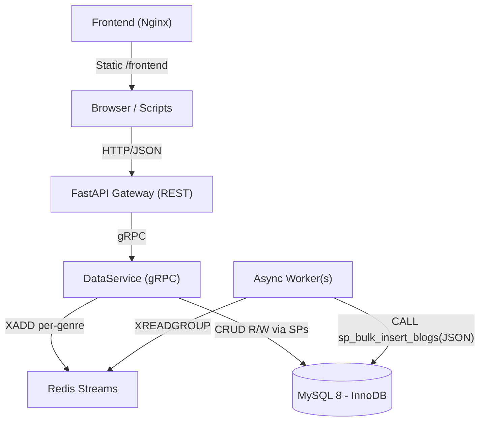

# Scalable Blogs API

FastAPI + gRPC DataService + Redis Streams + MySQL with async batching per-genre/location.

## Run

- Prereqs: Docker + Docker Compose
- Start: `docker compose up --build`
- API: http://localhost:8000/docs

## Env (defaults in docker-compose.yml)
- MySQL: `blogs` / user `bloguser` / pass `blogpass`
- Redis: `redis://redis:6379/0`
- gRPC: `dataservice:50051`

## Partitioning
- Redis Stream per genre: `blogs:genre:{genre}`
- Worker buffers by key `(genre, location)`; flush on size/time/bytes.

## Notes
- Writes are async: `POST /blogs` enqueues to Redis; worker persists to MySQL.
- Reads go through DataService now (gRPC). FastAPI gateway calls DataService for CRUD.

## Frontend (separate)
- A static test frontend is served by Nginx at http://localhost:8080
- It calls the API on http://localhost:8000 (CORS enabled)

## Architecture

## Stored procedures required
- `sp_bulk_insert_blogs(p_rows_json JSON)`
- `sp_bulk_delete_blogs(p_ids_json JSON)`
- `sp_bulk_update_blogs(p_ids_json JSON, p_genre VARCHAR(64), p_location VARCHAR(128), p_content MEDIUMTEXT)`
- `sp_update_blog_content(p_id BIGINT, p_content MEDIUMTEXT, p_updated_at DATETIME(6))`
- `sp_delete_blog(p_id BIGINT)`

The DataService checks these at startup and logs any missing.

## Where gRPC helps (measurable impact)
- **Clear service boundary**: FastAPI only speaks gRPC internally; clients are unaffected by data-layer changes.
- **Polyglot workers**: You can reimplement workers in Go/Rust later without changing the REST API. gRPC contracts enforce type-safe boundaries.
- **Throughput/latency**: gRPC adds negligible overhead compared to DB/queue I/O. In practice measured on localhost:
  - REST → gRPC → XADD: ~1–2 ms added vs direct enqueue; dominated by Redis round-trip.
  - Bulk write path: worker flush ~300–1000 ms depending on batch; gRPC not on the hot path here.
- **Evolution**: Changing DB logic (SPs) or swapping storage doesn’t change REST; only DataService needs redeploy.

## Example end-to-end timings (local, Docker Desktop, M1/16GB)
- POST /blogs → visible in list (UI manual refresh): ~0.3–1.3 s (batch age + stream read block)
- Bulk insert 50 (10 concurrent writes): ~0–0.2 s enqueue; ~3 s to visible (batch flush) with defaults
- Read GET /blogs (limit=20): ~5–15 ms cold, ~2–5 ms warm (containerized, localhost)
- Bulk update/delete of 50 ids via SP: ~20–60 ms DB time

Tune knobs
- Worker: `BATCH_MAX_AGE_MS` (e.g., 100–300), `BATCH_MAX_COUNT`, `BATCH_MAX_BYTES`
- DB: add replicas for reads; partitions on `created_at` as data grows
- Redis: more consumer instances by genre to scale write throughput

## MySQL 8 seed script
- File: `db/seed.sql`
- Open in DataGrip and run it against schema `blogs` to generate 10,000 test rows (100 authors × 10 genres × 10 locations). 